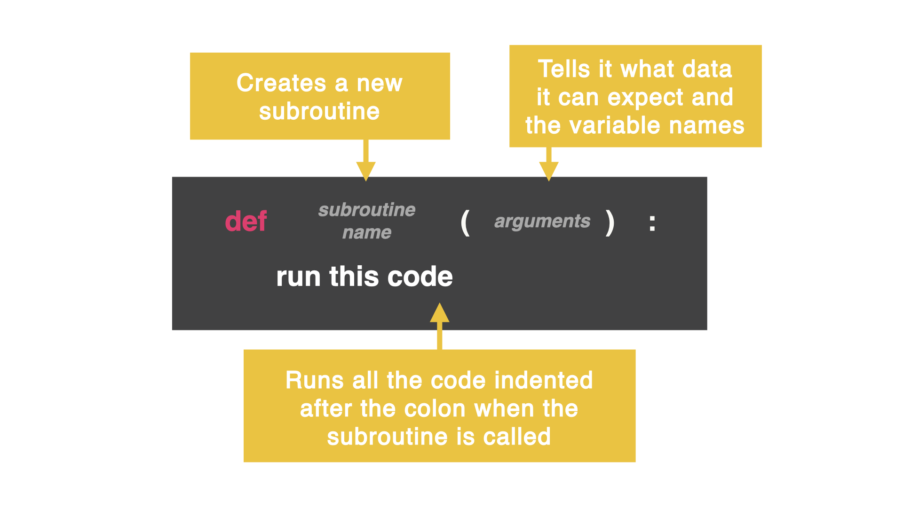

# Subroutine
So far, when we wanted to repeat code, we have had to use loops or copy and paste code.

What if I told you there was a way to use code or call it and use it anytime anywhere??

That is a **subroutine**!!

A **subroutine** tells the computer that a piece of code exists and to go run that code again and again...

## Just like a recipe

Subroutines work like a recipe in a cookbook. If you want to know how to make a cake, you don't have to start from scratch every time. You can use a recipe to get the same quality each time.

## How do we define a subroutine? 

A subroutine is defined by:

```
def (which stands for definition)
```

You need to give the subroutine a name (and just like with a variable, you can't have spaces).




You need to add `()` even if there are no arguments followed by a colon `:`. The code needs to be indented.

## Let's try it

👉 Let's roll a random number on a six-sided dice. Copy the code below and click `run`. 
```python
def rollDice():
  import random
  dice = random.randint(1, 6)
  print("You rolled", dice)
  ```
**Why is nothing happening??**

In this code, I have defined how to roll a dice (this is my recipe for rolling a dice), but I have not actually 'called' the program to run.

